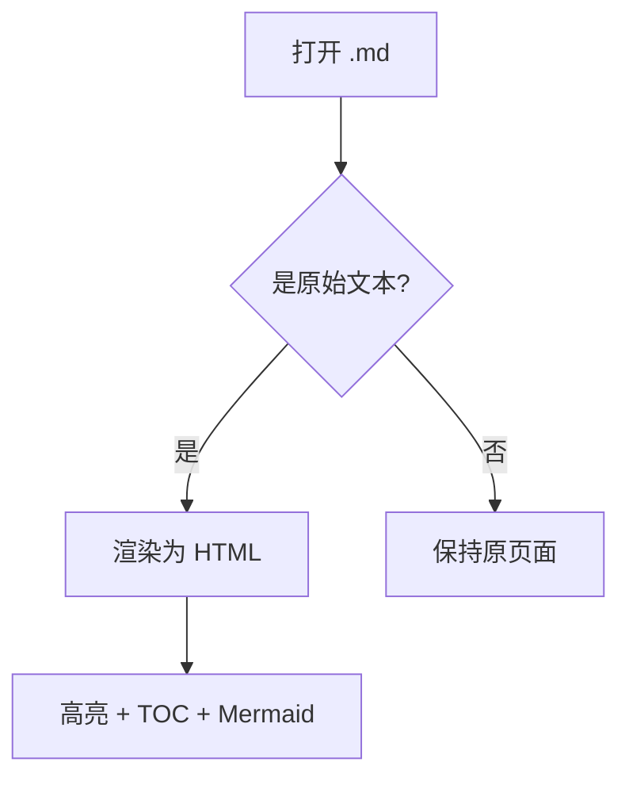

# Markdown Viewer 测试文档

这是一个用来验证扩展渲染效果的示例文件。把它拖进浏览器，或直接打开它的 `file://` 链接。

## 功能清单

- **代码高亮**（highlight.js）
- 目录 / 大纲 TOC
- 亮 / 暗主题切换（右上角 🌓）
- Mermaid 图表

### 代码高亮示例

```js
function greet(name) {
  const msg = `Hello, ${name}!`;
  console.log(msg);
  return msg;
}
```

```python
def fib(n):
    a, b = 0, 1
    for _ in range(n):
        a, b = b, a + b
    return a
```

## 表格

| 功能 | 库 | 状态 |
| --- | --- | --- |
| 解析 | marked | ✅ |
| 清洗 | DOMPurify | ✅ |
| 高亮 | highlight.js | ✅ |

## 引用

> 这是一段引用文本，用于测试样式。

## Mermaid 图表



## 深层标题测试

### 三级标题

#### 四级标题

结束。
